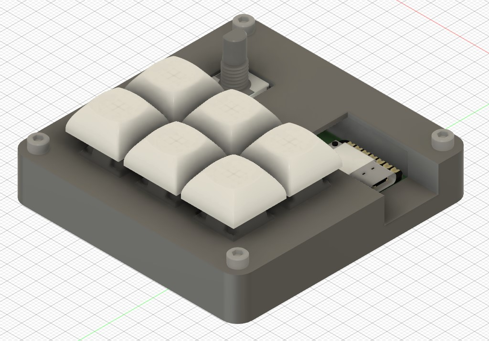
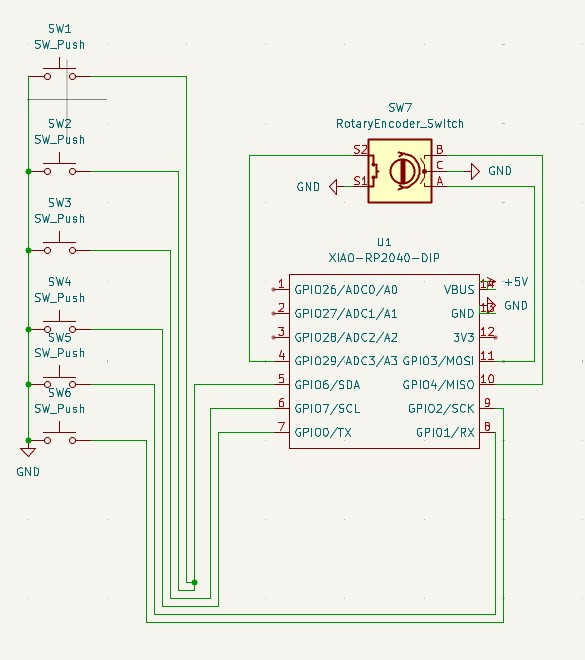
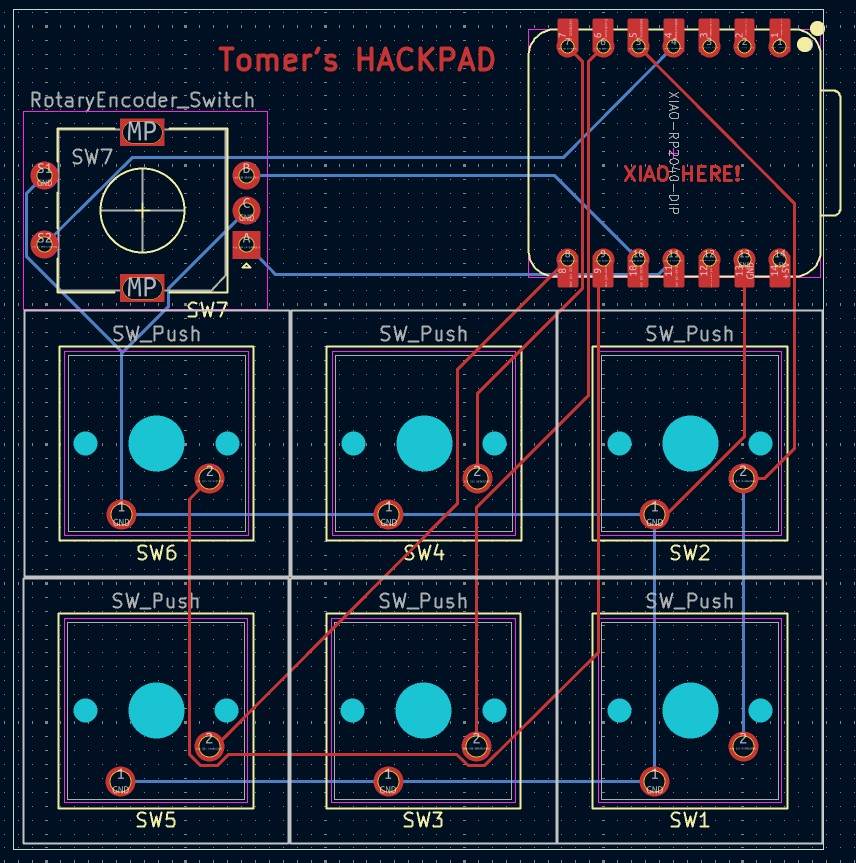

# Tomer-s-Macropad
My very first hackpad through hackclub
Also my first hardware project ever! It was very fun, but I probably could have done things way better.

BOM:
6x Cherry MX Switches
6x DSA keycaps
1x XIAO RP2040
4x Through-hole 1N4148 Diodes
4x M3x16mm screws
1x EC11E rotary encoder
1x case, made of 2 printed parts (in the step file under CAD)

Here is a picture of the final HackPad!

Here are pictures the schematic, PCB, and case model

