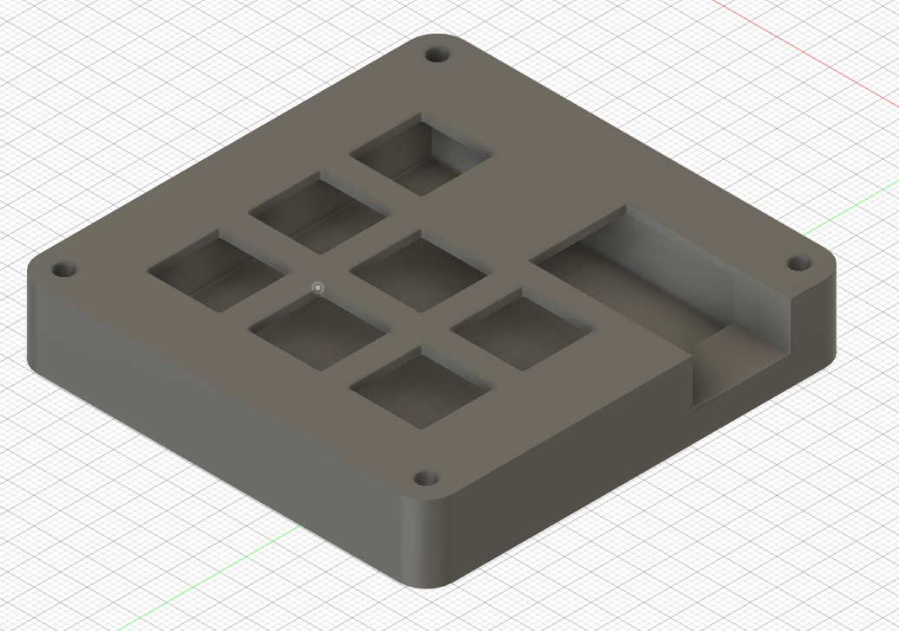

# Tomer's Macropad

This is a custom, programmable macropad powered by a Seeed Studio XIAO RP2040, KMK firmware, a custom PCB, and a 3D-printed case. This is my first hardware project, completed to improve both my engineering skills and my day to day life with shortcuts and a rotary encoder.

## What It Does

- 6 mechanical keys with Cherry MX switches and DSA keycaps
- Rotary encoder (EC11) for volume up/down and mute
- Custom firmware using KMK (CircuitPython-based mechanical keyboard firmware)
- PC-side macros for application-specific shortcuts
- Custom PCB and 3D-printed case

## Bill of Materials

- 6× Cherry MX Switches
- 6× DSA keycaps
- 1× Seeed Studio XIAO RP2040
- 4× 1N4148 diodes (through-hole)
- 1× EC11 rotary encoder
- 4× M3×16mm screws
- 1× case (2 printed parts, STEP file in `CAD/`)

## Features

### Firmware

- One primary layer with 7 keys: A, B, C, D, E, F, and MUTE
- Rotary encoder:
  - Turn clockwise for volume up (`KC.VOLU`)
  - Turn counter-clockwise for volume down (`KC.VOLD`)

### PC Macros

- Custom macros configured on my PC for workflow shortcuts such as an auto clicker, opening certain apps, etc.

## Hardware

### Wiring

- See wiring diagrams below!
- The XIAO RP2040 is used as the main microcontroller.
- Keys are wired with diodes and directly to GPIO pins.
- Rotary encoder is wired to `GP0` (A) and `GP1` (B).

### PCB

- Custom PCB designed for the macropad.
- Screenshot of the PCB layout is shown below.

### Case

- 3D-printed case made of two parts.
- STEP file available in `CAD/`.
- Assembly uses 4× M3×16mm screws.

## Assembly / Build Steps

Coming Soon...

## Firmware

- Written in CircuitPython using the KMK library.
- Main file: `macropad.py` in the repo root.
- Keymap: 1 layer with 7 inputs (6 keys + encoder button).
- Encoder actions: volume up/down.

To flash:

1. Put the XIAO RP2040 in bootloader mode (double-press reset or connect BOOT0).
2. Copy `macropad.py` to the `CIRCUITPY` drive.
3. Ensure the `KMK` library is installed on the CIRCUITPY drive.

## Lessons Learned

- First hardware project: learned PCB layout, soldering, and embedded firmware for mechanical keyboards using KMK and CircuitPython.
- Discovered how rotary encoders work and how to integrate them into KMK firmware.
- Improved Github skills (first repo as well!)
- Overall increase in problem solving through the many issues that came with the building process.

## Future Improvements

- Add a second firmware layer for app-specific shortcuts.
- Add an OLED display.
- Improve the keymap with more complex macros in the firmware instead of PC-side macros.
- Document the build process with more photos and quantitative test results (e.g., debounce behavior, latency).

## Photos

Here is a picture of the final HackPad, schematic, PCB, and case model!

